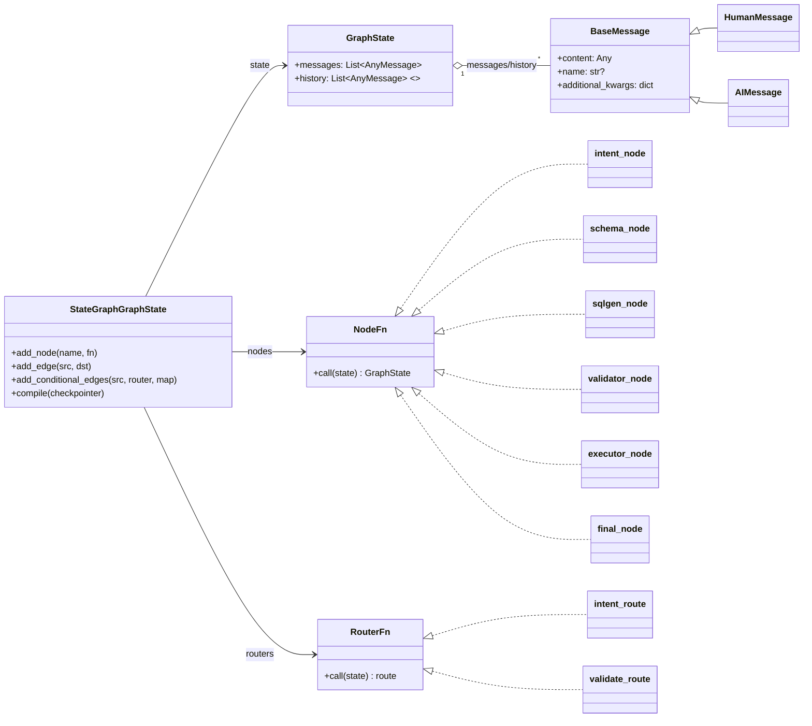
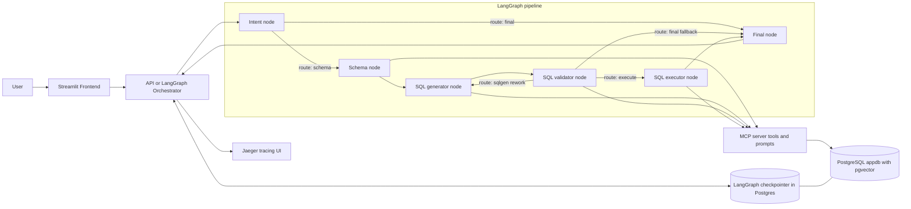

# 🧠 SQL Agent Example  
**End-to-End Multi-Agent Text-to-SQL System with LangGraph, MCP, RAG, OpenTelemetry & Streamlit**

This project demonstrates a **fully containerized, observable, multi-agent Text-to-SQL architecture**, built around **LangGraph**, **FastAPI**, **PostgreSQL + pgvector**, and **OpenTelemetry**.

Natural-language questions are routed through specialized agents (Intent, Schema, SQL Generation, Validation, Execution) and executed safely against a relational database — with **full distributed tracing via Jaeger** and a **Streamlit chat UI**.

---

## ✨ Key Features

- 🧩 **Multi-Agent Architecture**
  - Intent classification  
  - Schema understanding  
  - SQL generation  
  - SQL validation & retries  
  - Secure SQL execution  
  
- 🧠 **LangGraph State Machine**
  - Conditional routing  
  - Retry loops  
  - Persistent state via PostgreSQL checkpointer  
  
- 🧬 **RAG over Database Schema**
  - pgvector + embeddings  
  - Schema and metadata retrieval via MCP server  

- 🔍 **Full Observability**
  - OpenTelemetry spans  
  - Jaeger UI with end-to-end traces  
  - Agent-level latency & routing visibility

  <p align="center">
    
  </p>

- 🖥 **Streamlit Frontend**
  - Chat interface  
  - SQL preview & parameters  
  - Query result inspection

  <p align="center">
    
  </p>

- 🐳 **100% Dockerized**
  - One-command startup  
  - Health-checked service dependencies  

  <p align="center">
    
  </p>

---

## 🧱 UML Class Diagram



## 🧱 UML Sequence Diagram

```mermaid
sequenceDiagram
autonumber
actor U as User
participant UI as Streamlit UI
participant API as API (LangGraph Orchestrator)
participant IA as Intent Agent
participant SA as Schema Agent
participant GA as SQL-Gen Agent
participant VA as SQL-Validator Agent
participant EA as SQL-Executor Agent
participant MCP as MCP Server (tools/prompts)
participant PG as Postgres (appdb + pgvector)
participant CP as Checkpointer (LangGraph in Postgres)
participant J as Jaeger

U->>UI: Enter question
UI->>API: POST /chat {content, thread_id}
API->>J: create trace/span for request
API->>CP: load state by thread_id
CP-->>API: state (history/messages)

API->>IA: POST /messages (history + latest user msg)
IA->>MCP: get_prompt(intent) + tools (if any)
MCP-->>IA: prompt/tools
IA-->>API: JSON {route: schema|final, ...}
API->>J: span: intent_route

alt route == final
  API->>API: final_node (direct answer)
  API->>CP: save updated state
  CP-->>API: ok
  API-->>UI: JSON response (direct_answer)
  UI-->>U: Render answer
else route == schema
  API->>SA: POST /messages
  SA->>MCP: call tool schema_search / introspect_db
  MCP->>PG: SELECT ... (introspection / RAG schema)
  PG-->>MCP: rows
  MCP-->>SA: tool result
  SA-->>API: schema_context
  API->>J: span: schema_node

  API->>GA: POST /messages (with schema_context)
  GA->>MCP: call tool list_join_cards / schema_search (optional)
  MCP->>PG: SELECT ... (schema join cards / RAG)
  PG-->>MCP: rows
  MCP-->>GA: tool result
  GA-->>API: SQL draft + params + explanation
  API->>J: span: sqlgen_node

  loop validation retries (max 3)
    API->>VA: POST /messages (SQL draft)
    VA->>MCP: call tool validate_sql
    MCP-->>VA: {decision: pass|rework, issues, feedback}
    VA-->>API: JSON {route: sql_pipeline|direct_answer, decision, ...}
    API->>J: span: validator_node

    alt decision == rework AND route == sql_pipeline
      API->>GA: POST /messages (feedback_for_sql_gen)
      GA-->>API: revised SQL draft + params
      API->>J: span: sqlgen_rework
    else decision == pass AND route == sql_pipeline
      break
    else route == direct_answer
      API->>API: final_node (fallback clarifying questions)
      API->>CP: save updated state
      CP-->>API: ok
      API-->>UI: JSON response (direct_answer)
      UI-->>U: Render answer
      break
    end
  end

  opt execution (only if validation passed)
    API->>EA: POST /messages (validated SQL + params)
    EA->>MCP: call tool execute_sql(sql, params)
    MCP->>PG: SET LOCAL statement_timeout=...; SELECT ...
    PG-->>MCP: rows (truncated to max_rows)
    MCP-->>EA: {columns, rows, row_count, truncated}
    EA-->>API: JSON {direct_answer, result_preview}
    API->>J: span: executor_node
  end

  API->>API: final_node (format response)
  API->>CP: save updated state
  CP-->>API: ok
  API-->>UI: JSON response
  UI-->>U: Render answer + SQL popover
end
```

## 🧱 Data Flow Diagram (DFD)



---

## 🏗 Architecture Overview

```
User (Streamlit)
   ↓
API (LangGraph Orchestrator)
   ↓
Intent Agent
   ↓
Schema Agent
   ↓
SQL Generator Agent
   ↓
SQL Validator Agent (retry loop)
   ↓
SQL Executor Agent
   ↓
Final Answer + Trace
```

---

## 📁 Project Structure

```
sql_agent_example/
│
├── api/                     # LangGraph orchestrator (FastAPI)
│   ├── app/
│   │   ├── graph.py         # StateGraph + routing logic
│   │   └── main.py
│   └── Dockerfile
│
├── intent-agent/             # Intent classification agent
├── schema-agent/             # DB schema understanding agent
├── sql-gen-agent/            # SQL generation agent
├── sql-validator-agent/      # SQL validation + retry policy
├── sql-executor-agent/       # Secure SQL execution agent
│
├── mcp-server/               # MCP tools + schema/RAG access
├── rag-init/                 # Vector store bootstrap
│
├── streamlit-frontend/       # Chat UI
│
├── sql/
│   ├── 00_schema.sql         # Sample schema
│   └── 01_extensions.sql     # pgvector, extensions
│
├── docker-compose.yml
├── .env_example
└── README.md
```

---

## ⚙️ Services & Ports

| Service | Description | Port |
|------|------------|------|
| PostgreSQL + pgvector | Database | `5432` |
| MCP Server | Schema + RAG tools | `3333` |
| Intent Agent | Intent routing | `8001` |
| Schema Agent | Schema reasoning | `8002` |
| SQL Gen Agent | SQL drafting | `8003` |
| SQL Validator | Validation & retry | `8004` |
| SQL Executor | Query execution | `8005` |
| API Orchestrator | LangGraph | `8000` |
| Streamlit UI | Chat frontend | `8501` |
| Jaeger UI | Tracing | `16686` |

---

## 🚀 Running the Project

### 1️⃣ Configure Environment

```bash
cp .env_example .env
```

Set at least:

```env
OPENAI_API_KEY=sk-...
```

---

### 2️⃣ Start Everything

```bash
docker compose up --build
```

All services include **health checks** and start in the correct order.

---

### 3️⃣ Open the UIs

- 💬 **Chat UI (Streamlit)**  
  http://localhost:8501

- 🔍 **Jaeger Tracing UI**  
  http://localhost:16686

---

## 🔐 Safety & Guardrails

- ❌ No DDL / destructive SQL  
- ❌ No multi-statement execution  
- ✅ Parameterized queries  
- ✅ Validator retry limits  
- ✅ Clear fallback to direct answers  

---

## 📜 License

MIT — do whatever you want, just don’t blame the agents 😉
