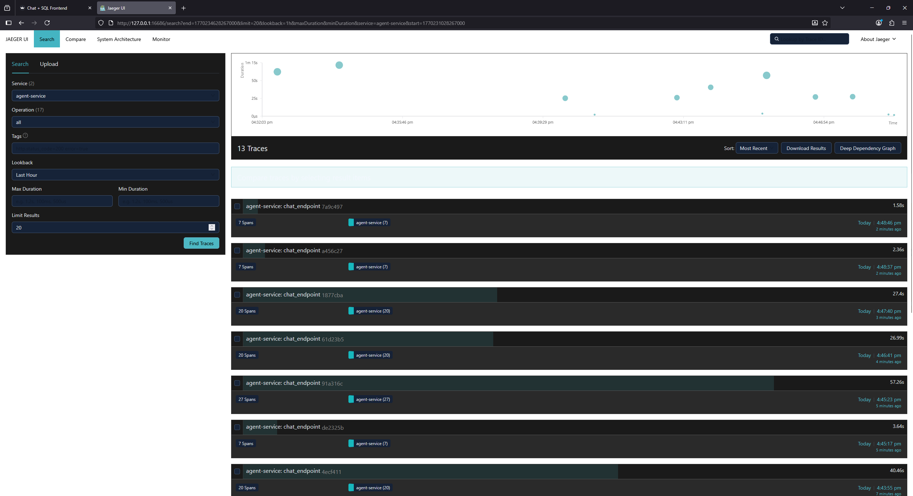
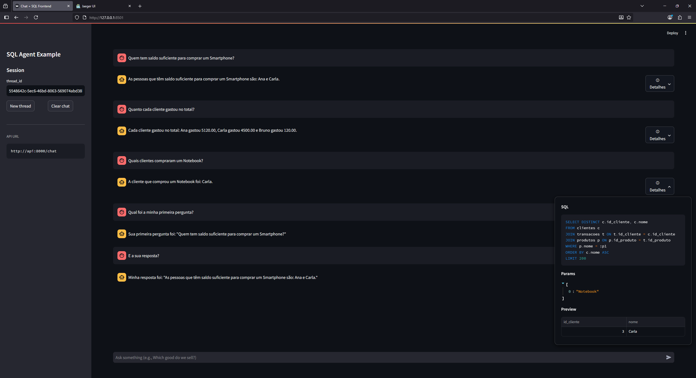
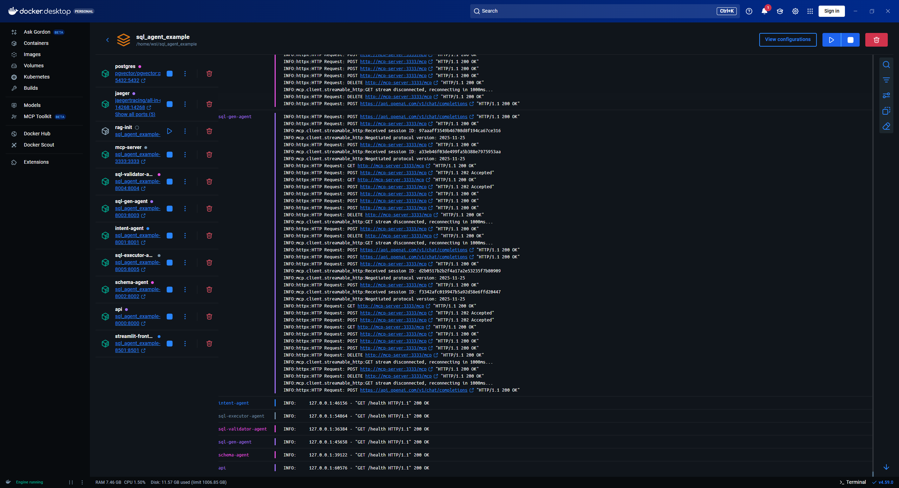
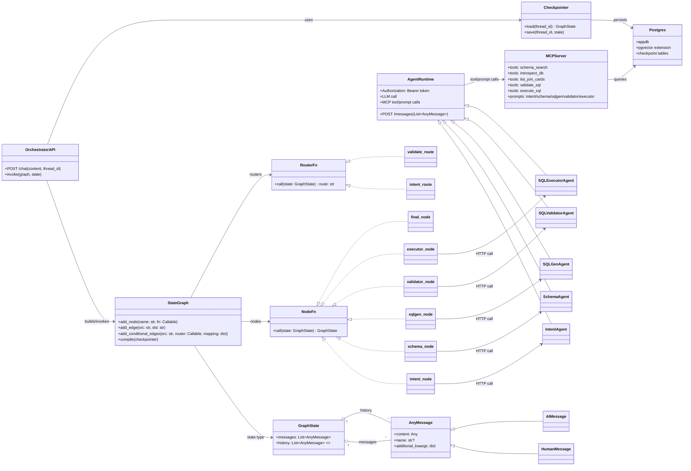
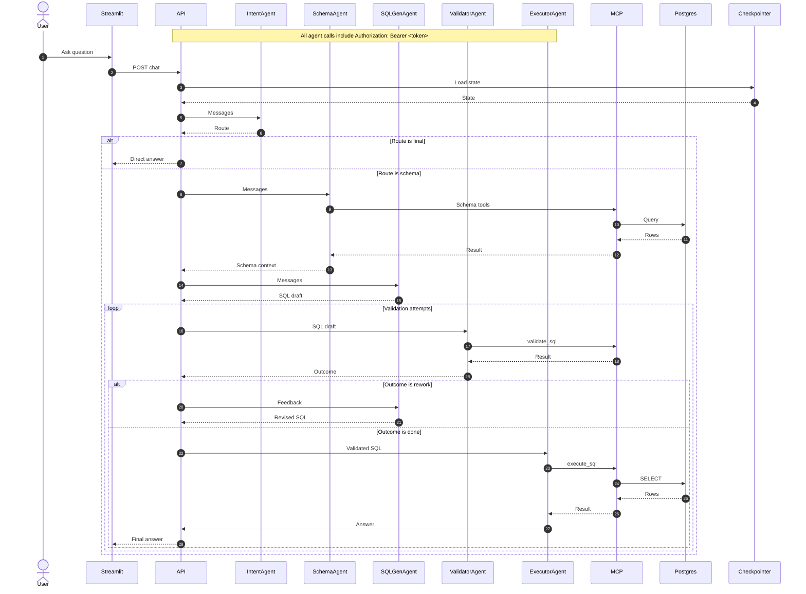
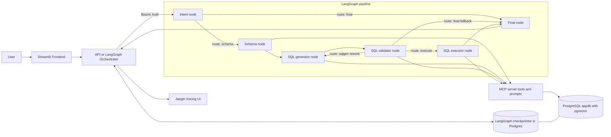

# 🧠 SQL Agent Example  
**End-to-End Multi-Agent Text-to-SQL System with LangGraph, MCP, RAG, OpenTelemetry & Streamlit**

This project demonstrates a **fully containerized, observable, multi-agent Text-to-SQL architecture**, built around **LangGraph**, **FastAPI**, **PostgreSQL + pgvector**, and **OpenTelemetry**.

Natural-language questions are routed through specialized agents (Intent, Schema, SQL Generation, Validation, Execution) and executed safely against a relational database — with **full distributed tracing via Jaeger** and a **Streamlit chat UI**.

---

## ✨ Key Features

- 🧩 **Multi-Agent Architecture**
  - Intent classification  
  - Schema understanding  
  - SQL generation  
  - SQL validation & retries  
  - Secure SQL execution  

- 🧠 **LangGraph State Machine**
  - Conditional routing  
  - Retry loops  
  - Persistent state via PostgreSQL checkpointer  

- 🧬 **RAG over database schema and metadata (pgvector)**
  - pgvector + embeddings  
  - Schema and metadata retrieval via MCP server  

- 🔍 **Full Observability**
  - OpenTelemetry spans  
  - Jaeger UI with end-to-end traces  
  - Agent-level latency & routing visibility

  <p align="center">
    
  </p>

- 🖥 **Streamlit Frontend**
  - Chat interface  
  - SQL preview & parameters  
  - Query result inspection

  <p align="center">
    
  </p>

- 🐳 **100% Dockerized**
  - One-command startup  
  - Health-checked service dependencies  

  <p align="center">
    
  </p>

---

## 🧱 UML Class Diagram



## 🧱 UML Sequence Diagram



## 🧱 Data Flow Diagram (DFD)



---

## 🏗 Architecture Overview

```
User (Streamlit)
   ↓
API (LangGraph Orchestrator)
   ↓
Intent Agent
   ├──→ Final Answer (direct response)
   └──→ Schema Agent
           ↓
       SQL Generator Agent
           ↓
       SQL Validator Agent
           ├──→ SQL Generator (rework loop)
           ├──→ Final Answer (fallback)
           └──→ SQL Executor Agent
                   ↓
               Final Answer + Trace
```
---

## 🔐 Service-to-Service Authentication (Bearer Token)

Communication between the **Orchestrator API** and all **Agent services** is protected using **HTTP Bearer Token authentication**.

### How it works

- A shared secret token (`AGENT_API_TOKEN`) is configured via environment variables
- The **Orchestrator** includes the token in every agent request: Authorization: Bearer <AGENT_API_TOKEN>
- Each **Agent Runtime** validates the token before processing `/messages`
- Requests without a valid token are rejected with `401 Unauthorized`

This ensures that:
- Only the orchestrator can invoke agents
- Agents are not callable by external clients
- The system remains secure even when deployed across networks

### Scope

- Authentication applies **only to internal service-to-service calls**
- End-user authentication (UI → API) is intentionally out of scope

### Configuration

```env
AGENT_API_TOKEN=super-long-random-secret
```

The same token must be provided to:

- api (orchestrator)

- all agent containers (intent-agent, schema-agent, etc.)

This is **concise, explicit, and production-grade**.

---

## 📁 Project Structure

```
sql_agent_example-main/
│
├── api/                     # LangGraph orchestrator (FastAPI)
│   ├── app/
│   │   ├── graph.py         # StateGraph + routing logic
│   │   └── main.py
│   ├── Dockerfile
│   └── requirements.txt
│
├── agent-gen/               # Generic agent runtime (all agents share this image)
│   ├── main.py              # FastAPI /messages endpoint + LLM invocation
│   ├── Dockerfile
│   └── requirements.txt
│
├── mcp-server/              # MCP tools + prompts (schema/RAG/validation/execution)
│   ├── mcp_server.py
│   ├── Dockerfile
│   └── requirements.txt
│
├── rag-init/                # Vector store bootstrap (pgvector KB seeding)
│   ├── rag_setup.py
│   ├── Dockerfile
│   └── requirements.txt
│
├── streamlit-frontend/      # Chat UI
│   ├── main.py
│   ├── Dockerfile
│   └── requirements.txt
│
├── sql/
│   ├── 00_schema.sql         # Sample schema
│   └── 01_extensions.sql     # pgvector, extensions
│
├── png/                      # README assets
│   ├── opentelemetry.png
│   ├── streamlit.png
│   └── docker.png
│
├── docker-compose.yml
├── .env_example
└── README.md
```

---

## ⚙️ Services & Ports

| Service | Description | Port |
|------|------------|------|
| PostgreSQL + pgvector | Database | `5432` |
| MCP Server | Schema + RAG tools | `3333` |
| Intent Agent | Intent routing | `8001` |
| Schema Agent | Schema reasoning | `8002` |
| SQL Gen Agent | SQL drafting | `8003` |
| SQL Validator | Validation & retry | `8004` |
| SQL Executor | Query execution | `8005` |
| API Orchestrator | LangGraph | `8000` |
| Streamlit UI | Chat frontend | `8501` |
| Jaeger UI | Tracing | `16686` |

---

## 🚀 Running the Project

### 1️⃣ Configure Environment

```bash
cp .env_example .env
```

Set at least:

```env
OPENAI_API_KEY=sk-...
```

---

### 2️⃣ Start Everything

```bash
docker compose up --build
```

All services include **health checks** and start in the correct order.

---

### 3️⃣ Open the UIs

- 💬 **Chat UI (Streamlit)**  
  http://localhost:8501

- 🔍 **Jaeger Tracing UI**  
  http://localhost:16686

---

## 🔐 Safety & Guardrails

- ❌ No DDL / destructive SQL  
- ❌ No multi-statement execution  
- ✅ Parameterized queries  
- ✅ Validator retry limits  
- ✅ Clear fallback to direct answers
- ✅ Statement timeout enforcement
- ✅ Result row truncation
- 🔐 Authenticated agent access via Bearer token (orchestrator → agents)

---

## 📜 License

MIT — do whatever you want, just don’t blame the agents 😉
