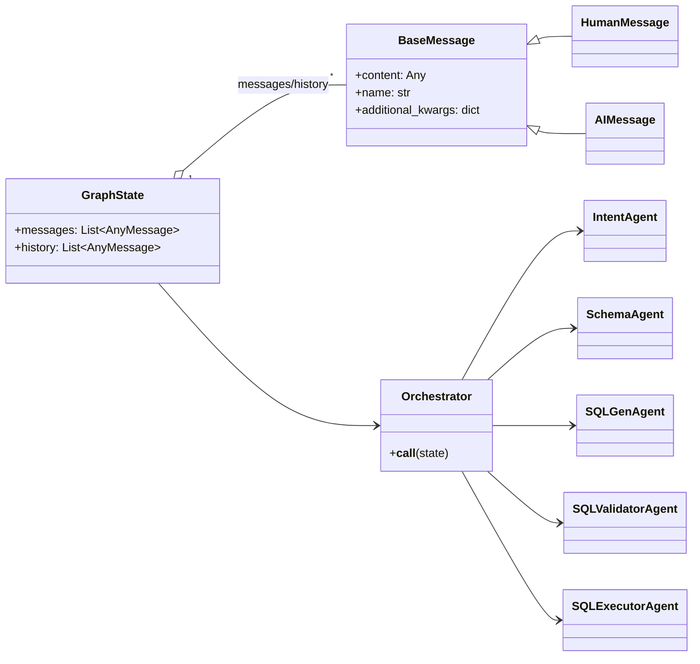
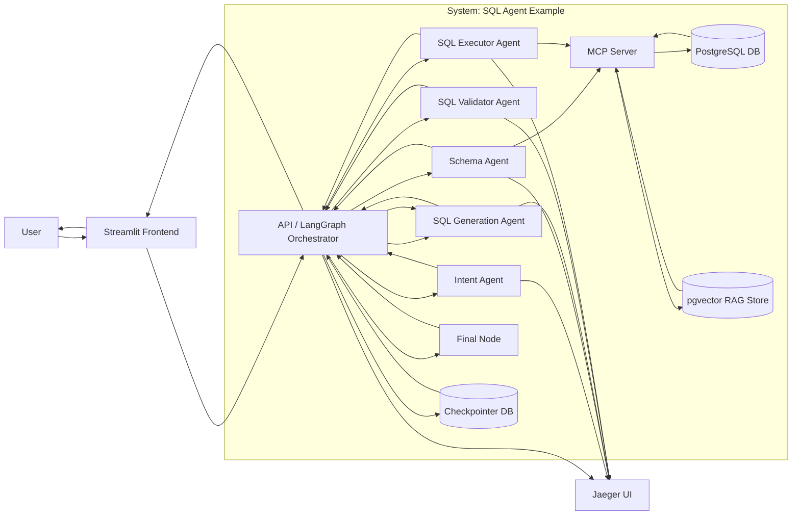

# 🧠 SQL Agent Example  
**End-to-End Multi-Agent Text-to-SQL System with LangGraph, MCP, RAG, OpenTelemetry & Streamlit**

This project demonstrates a **fully containerized, observable, multi-agent Text-to-SQL architecture**, built around **LangGraph**, **FastAPI**, **PostgreSQL + pgvector**, and **OpenTelemetry**.

Natural-language questions are routed through specialized agents (Intent, Schema, SQL Generation, Validation, Execution) and executed safely against a relational database — with **full distributed tracing via Jaeger** and a **Streamlit chat UI**.

---

## ✨ Key Features

- 🧩 **Multi-Agent Architecture**
  - Intent classification  
  - Schema understanding  
  - SQL generation  
  - SQL validation & retries  
  - Secure SQL execution  
  
- 🧠 **LangGraph State Machine**
  - Conditional routing  
  - Retry loops  
  - Persistent state via PostgreSQL checkpointer  
  
- 🧬 **RAG over Database Schema**
  - pgvector + embeddings  
  - Schema and metadata retrieval via MCP server  

- 🔍 **Full Observability**
  - OpenTelemetry spans  
  - Jaeger UI with end-to-end traces  
  - Agent-level latency & routing visibility

  <p align="center">
    
  </p>

- 🖥 **Streamlit Frontend**
  - Chat interface  
  - SQL preview & parameters  
  - Query result inspection

  <p align="center">
    
  </p>

- 🐳 **100% Dockerized**
  - One-command startup  
  - Health-checked service dependencies  

  <p align="center">
    
  </p>

---

## 🧱 Diagrams





---

## 🏗 Architecture Overview

```
User (Streamlit)
   ↓
API (LangGraph Orchestrator)
   ↓
Intent Agent
   ↓
Schema Agent
   ↓
SQL Generator Agent
   ↓
SQL Validator Agent (retry loop)
   ↓
SQL Executor Agent
   ↓
Final Answer + Trace
```

---

## 📁 Project Structure

```
sql_agent_example/
│
├── api/                     # LangGraph orchestrator (FastAPI)
│   ├── app/
│   │   ├── graph.py         # StateGraph + routing logic
│   │   └── main.py
│   └── Dockerfile
│
├── intent-agent/             # Intent classification agent
├── schema-agent/             # DB schema understanding agent
├── sql-gen-agent/            # SQL generation agent
├── sql-validator-agent/      # SQL validation + retry policy
├── sql-executor-agent/       # Secure SQL execution agent
│
├── mcp-server/               # MCP tools + schema/RAG access
├── rag-init/                 # Vector store bootstrap
│
├── streamlit-frontend/       # Chat UI
│
├── sql/
│   ├── 00_schema.sql         # Sample schema
│   └── 01_extensions.sql     # pgvector, extensions
│
├── docker-compose.yml
├── .env_example
└── README.md
```

---

## ⚙️ Services & Ports

| Service | Description | Port |
|------|------------|------|
| PostgreSQL + pgvector | Database | `5432` |
| MCP Server | Schema + RAG tools | `3333` |
| Intent Agent | Intent routing | `8001` |
| Schema Agent | Schema reasoning | `8002` |
| SQL Gen Agent | SQL drafting | `8003` |
| SQL Validator | Validation & retry | `8004` |
| SQL Executor | Query execution | `8005` |
| API Orchestrator | LangGraph | `8000` |
| Streamlit UI | Chat frontend | `8501` |
| Jaeger UI | Tracing | `16686` |

---

## 🚀 Running the Project

### 1️⃣ Configure Environment

```bash
cp .env_example .env
```

Set at least:

```env
OPENAI_API_KEY=sk-...
```

---

### 2️⃣ Start Everything

```bash
docker compose up --build
```

All services include **health checks** and start in the correct order.

---

### 3️⃣ Open the UIs

- 💬 **Chat UI (Streamlit)**  
  http://localhost:8501

- 🔍 **Jaeger Tracing UI**  
  http://localhost:16686

---

## 🔐 Safety & Guardrails

- ❌ No DDL / destructive SQL  
- ❌ No multi-statement execution  
- ✅ Parameterized queries  
- ✅ Validator retry limits  
- ✅ Clear fallback to direct answers  

---

## 📜 License

MIT — do whatever you want, just don’t blame the agents 😉
